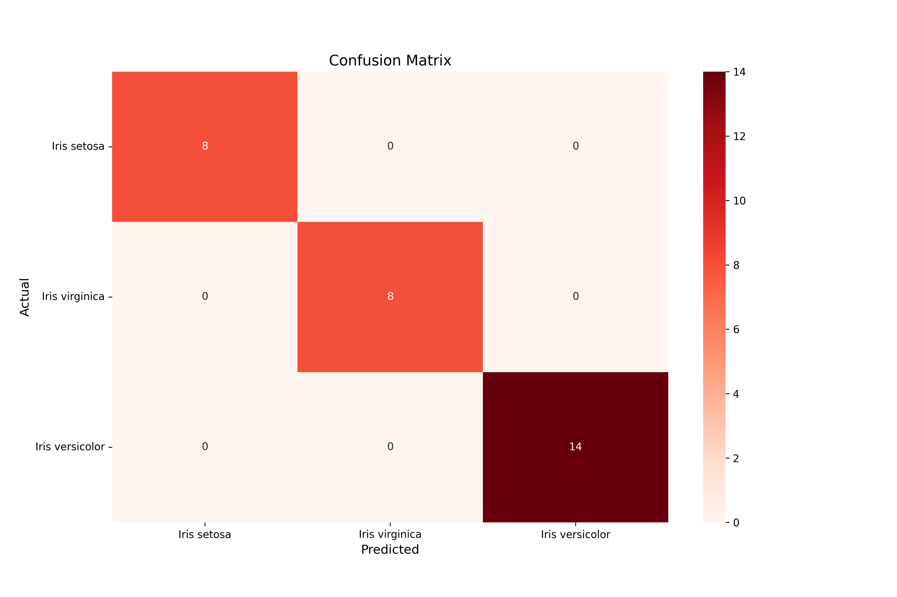
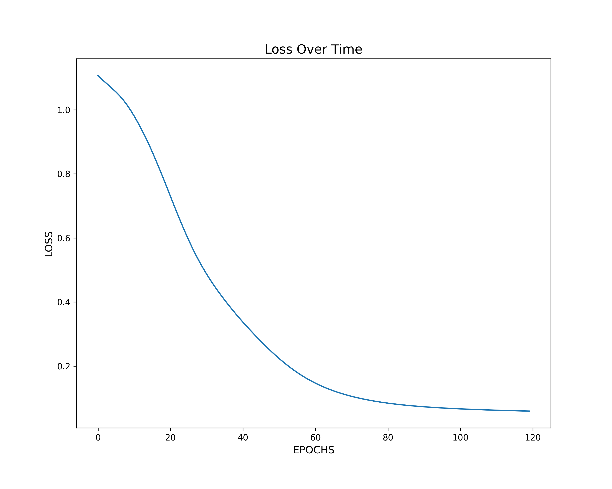

# Irirs_NN_classifier
This jupyter notebook walks you through the steps to create a very basic Neural Network (NN) able to classify 3 different types of iris flowers.

# Overview
For this project I built a very basic Neural Network (NN) capable of classifying three different types of iris flowers. The inspiration behind this project was to showcase the fundamental idea behind NN architectures. The notebook was created in a way that can be referenced by users who are *very* new to NN as there are many helpful comments throught the syntax that explain the reasoning behind it and may also suggest different methods, hyperparameters, or functions (i.e activation functions, loss functions, optimizers, etc). The fundamentals shown in this project can be expanded to far more complex architectures like autoencoders for image recreations, simple logistic regression, etc.

I was able to predict iris flowers with 100% accuracy from the test set and even showed how to "create" and predict an unseen iris flower to simulate how the model would perform with brand new data. For most beginners, this level of accuracy is very high and it can show the time efficiency of NN architectures for most basic projects. To build such architecture, I used the pytorch library and created a model class only using linear layers along with rectified linear unit activation functions to ensure the preceding values were normalized. This basic architecture allowed me to achieve time efficient (~2 minutes for training and testing of 150 instances) and solid results.

This confusion matrix shows all the instances of iris flowers tested against the actual predictions. The diagonal along the matrix shows that the model was able to accurately predict all the instances with no errors.

Here I plotted a graph that shows the loss (using Cross Entropy loss function) to visualize its performance as a function of *Epochs* (iterations). The pattern that we see here is what we would expect out of most classification problems, a relatively large loss at the start and quick drop as we increase the number of epochs.

# Notes
This notebook is a good starting point for anyone trying to see a simple example on building a very basic NN architecture. There are multiple comments and headers throughout the process that help understand either the logic or syntax used and it provides suggestions to try and change along the users exploration.

# Data
I used the [Iris Flower Dataset](https://en.wikipedia.org/wiki/Iris_flower_data_set) which is a multivariate data set most commonly used by most beginners while getting introduced to statistical classification techniques using machine learning. I downloaded the csv file from [this link](https://archive.ics.uci.edu/ml/datasets/iris) which also describes all properties of the data set.
